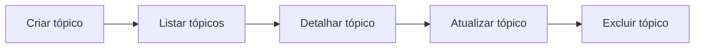
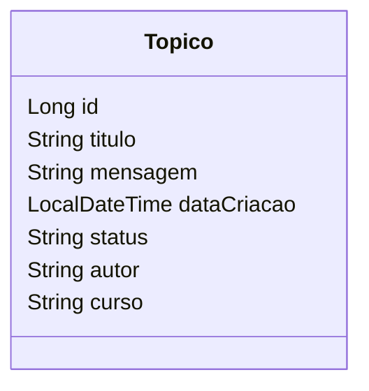
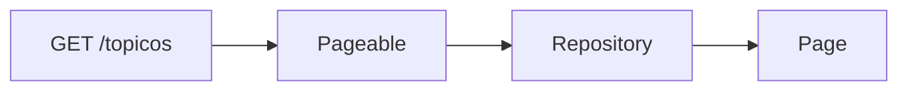

# 💬 Forum Hub – API REST

API REST desenvolvida em **Java com Spring Boot** para gerenciar tópicos de um fórum.
Permite **criar, listar, detalhar, atualizar e excluir** tópicos, utilizando boas práticas de desenvolvimento backend.

Projeto desenvolvido como parte do **Challenge Forum Hub – Alura**.

---

## 🚀 Tecnologias

* Java 17
* Spring Boot 3
* Spring Data JPA
* Hibernate
* MySQL
* Maven

---

## 📌 Funcionalidades



---

## 📚 Endpoints

| Método | URL             | Descrição           |
| ------ | --------------- | ------------------- |
| POST   | `/topicos`      | Cadastrar um tópico |
| GET    | `/topicos`      | Listar tópicos      |
| GET    | `/topicos/{id}` | Detalhar tópico     |
| PUT    | `/topicos/{id}` | Atualizar tópico    |
| DELETE | `/topicos/{id}` | Excluir tópico      |

---

## 🧠 Modelo do Tópico



---

## 📄 Exemplo de Requisição (POST)

```json
{
  "titulo": "Dúvida sobre Spring Boot",
  "mensagem": "Como funciona o @RequestBody?",
  "autor": "Rafael",
  "curso": "Spring"
}
```

---

## 📑 Listagem com Paginação

* Retorna **10 registros por página**
* Ordenação por **data de criação (ASC)**
* Utiliza `Pageable` e `@PageableDefault`



---

## ⚠️ Regras de Negócio

* ID obrigatório para detalhar, atualizar ou excluir
* Verificação de existência do tópico
* Retorno **404** quando não encontrado
* Validações com Bean Validation

---

## ▶️ Como executar

```bash
git clone https://github.com/Rafael540/Challenge_forum_hub.git
cd Challenge_forum_hub
mvn spring-boot:run
```

A aplicação ficará disponível em:

```
http://localhost:8080
```

---

## 📄 Licença

Projeto educacional desenvolvido para o **Challenge Forum Hub – Alura**.
Licença MIT.

---


